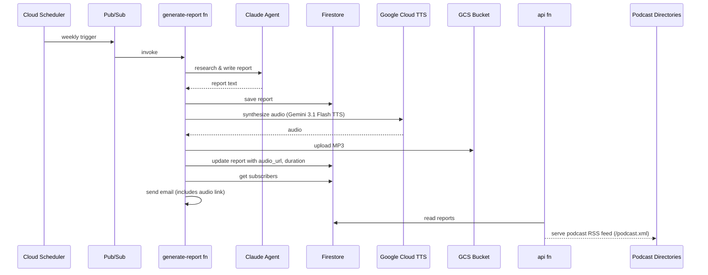

# Podcast Generation Spec

## Overview

Automatically convert each Weekly Deep Dive report into an audio podcast episode using Gemini 3.1 Flash TTS, store the audio in a GCS bucket, and serve a podcast-compliant RSS feed so the show can be listed on Apple Podcasts, Spotify, and other directories.

## Architecture Boundaries & Flow Diagram

The podcast generation step is added to the existing `generate_report` pipeline, after the report is saved to Firestore and before the email is sent. Audio generation is a side effect that should not block email delivery — if TTS fails, the report still publishes normally and an error alert is sent.

## Data Models

### Firestore `reports` collection — new fields

| Field | Type | Description |
|---|---|---|
| `audio_url` | string (nullable) | Public GCS URL of the MP3 file |
| `audio_duration_secs` | int (nullable) | Episode duration in seconds |
| `audio_generated_at` | timestamp (nullable) | When TTS completed |
| `audio_size_bytes` | int (nullable) | File size for RSS enclosure |

No migration needed — existing reports simply won't have these fields and will be excluded from the podcast feed.

### GCS bucket: `dev-deep-dive-podcast`

- Public read access on objects
- Lifecycle: none (episodes are permanent)
- Path pattern: `episodes/{report_id}.mp3`

## API Contracts & Interfaces

### New endpoint: `GET /podcast.xml`

Returns a podcast-compliant RSS 2.0 feed with iTunes namespace extensions. Only includes reports that have `audio_url` set.

Response: `Content-Type: application/rss+xml; charset=utf-8`

Required RSS elements for directory submission:

- `<itunes:author>`, `<itunes:summary>`, `<itunes:category>`, `<itunes:image>`, `<itunes:explicit>`
- Per-item: `<enclosure url="..." length="..." type="audio/mpeg" />`, `<itunes:duration>`

### Existing endpoint changes

- `GET /reports` and `GET /reports/{id}` — include `audio_url` and `audio_duration_secs` in response if present
- Email template — add "Listen to this episode" link when `audio_url` is present

### Internal function: `generate_podcast_audio(report: dict, report_id: str) -> dict`

Returns `{"audio_url": str, "duration_secs": int, "size_bytes": int}` or raises on failure.

## Voice Style Prompt

The following style prompt is passed to Gemini 3.1 Flash TTS with every synthesis request:

> Narrate in a relaxed, conversational public-radio style with a dry, intelligent, lightly skeptical tone. Sound informed and prepared, but not formal or announcer-like. Keep the delivery warm, plainspoken, and human, with subtle wit and a faint raised-eyebrow quality when emphasizing uncertainty, contradiction, or weak logic.
>
> Use a measured medium pace, clear diction, and natural phrasing. Avoid theatrical emotion, salesy enthusiasm, dramatic suspense, or overly polished "broadcast voice." The emotional delivery should feel curious, grounded, slightly wry, and confidently skeptical while remaining approachable and respectful.

## Dependencies

| Package | Justification |
|---|---|
| `google-genai>=1.0` | Gemini API client for Gemini 3.1 Flash TTS synthesis |
| `pydub>=0.25` | Convert raw audio to MP3 format for upload |

`ffmpeg` is required by pydub at runtime. The Cloud Functions Python 3.12 base image includes it.

## Security, Error Handling & Edge Cases

- **TTS failure is non-fatal.** If audio generation fails, the report still publishes (email, web, RSS). An error alert email is sent to `ADMIN_EMAIL`. The report's `audio_url` stays null.
- **Idempotency.** If re-triggered, check whether `audio_url` is already set on the report and skip TTS if so. This avoids duplicate GCS uploads and TTS charges.
- **Input limits.** Gemini 3.1 Flash TTS accepts large text inputs. If a report exceeds the context window, split at section boundaries and concatenate the audio.
- **Cost guardrail.** Log token counts before calling TTS. At ~$0.45/episode (~$2/month at weekly cadence), no hard enforcement needed.
- **GCS permissions.** The bucket uses uniform bucket-level access with `allUsers` as `objectViewer` for public read. Uploads use the default compute service account.

## Observability

- Log `INFO` at each stage: "Generating audio for report {id}", "TTS synthesized {n} chars in {t}s", "Uploaded {size} bytes to gs://...", "Updated report with audio_url"
- Log `WARNING` if TTS is skipped (audio already exists)
- Log `ERROR` with full exception if TTS or upload fails (triggers error alert email)

## Risks & Migration

- **No breaking changes.** New Firestore fields are additive and nullable. Existing reports without audio are excluded from the podcast feed.
- **Cost risk is low.** ~$0.45/episode, ~$2/month at weekly cadence. No free tier, but the cost is negligible. Can fall back to Chirp 3: HD (1M free chars/month) if Gemini TTS is discontinued or pricing changes.
- **ffmpeg availability.** The Python 3.12 Cloud Functions base image includes ffmpeg. If Google removes it in a future runtime update, pydub will fail — pin the base image or add a check.
- **Preview status.** Gemini 3.1 Flash TTS is in Preview. API surface may change. If it breaks, fall back to Chirp 3: HD.
- **Directory approval.** Apple Podcasts and Spotify require manual submission and review. The RSS feed must be live and contain at least one episode before submitting.

## Testing Strategy

- **Unit test `build_podcast_script(report)`** — verify section ordering, transition text insertion, and that output contains all sections.
- **Unit test `build_podcast_rss_xml(reports)`** — verify iTunes namespace, enclosure elements, duration formatting.
- **Integration test** — trigger a report generation in dev and verify: MP3 appears in GCS, Firestore doc updated, podcast.xml includes the episode, MP3 is publicly accessible.
- **Manual verification** — validate podcast.xml with [Podbase](https://podba.se/validate/) or Apple's feed validator before directory submission.

## Implementation Task Breakdown

- [ ] Create GCS bucket `dev-deep-dive-podcast` with public read access
- [ ] Add `google-genai>=1.0` and `pydub>=0.25` to `functions/generate_report/requirements.txt`
- [ ] Create `functions/generate_report/podcast_generator.py` with:
  - `build_podcast_script(report)` — assembles report sections into a single narration script with transitions
  - `synthesize_audio(script, report_id)` — calls Gemini 3.1 Flash TTS with voice style prompt, converts to MP3, uploads to GCS
  - `generate_podcast_audio(report, report_id)` — orchestrator that checks idempotency, calls the above, updates Firestore
- [ ] Wire `generate_podcast_audio()` into `functions/generate_report/main.py` after `save_report()`, wrapped in try/except (non-fatal)
- [ ] Create `functions/api/podcast_feed.py` with `build_podcast_rss_xml(reports)` — podcast-compliant RSS with iTunes extensions
- [ ] Add `GET /podcast.xml` route to `functions/api/main.py`
- [ ] Update `functions/api/firestore_client.py` — include `audio_url`, `audio_duration_secs`, `audio_size_bytes` in report responses
- [ ] Update `functions/generate_report/email_template.py` — add "Listen to this episode" link when `audio_url` is present
- [ ] Update `deploy.sh` — add `PODCAST_BUCKET` env var to generate-report function
- [ ] Update `.env.example` with `PODCAST_BUCKET`
- [ ] Add podcast.xml link to frontend nav and footer across all HTML pages
- [ ] Create podcast cover art image (1400x1400 minimum, 3000x3000 recommended) and upload to GCS
- [ ] Deploy and trigger a test episode
- [ ] Validate podcast RSS feed with Apple/Podbase validator
- [ ] Submit to Apple Podcasts and Spotify
- [ ] Update README roadmap to mark podcast generation as complete
